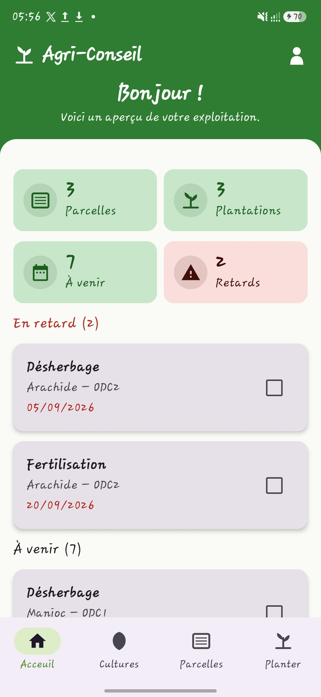
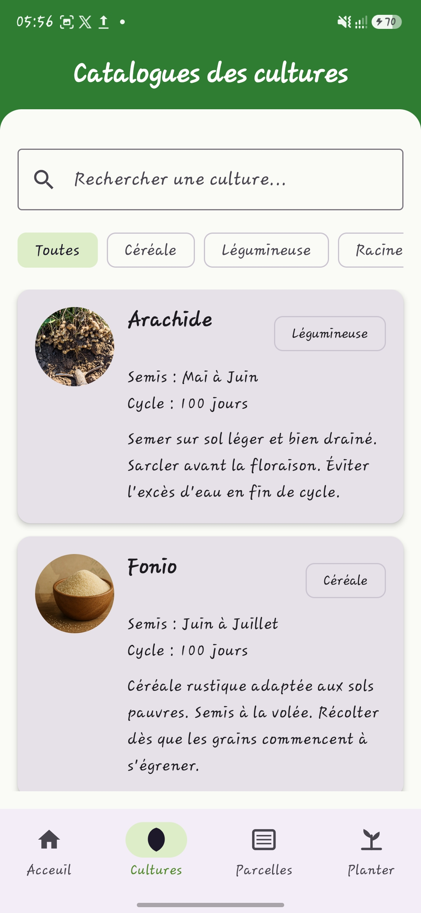
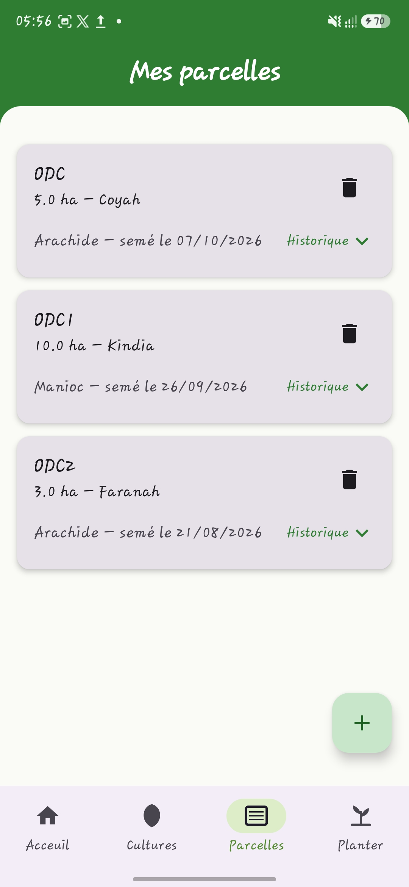
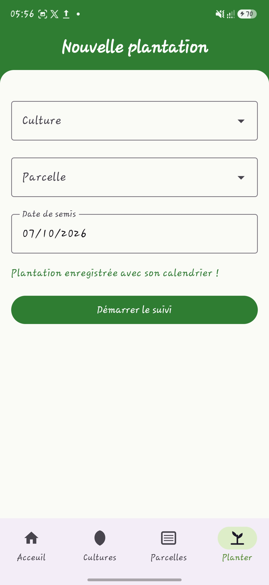

# 🌾 Agri-Conseil


**Projet fil rouge — Projet 8**
Formation Développement Mobile (Kotlin) — Orange Digital Center, 2026

> Planifier ses cultures, même sans connexion.

---

## 📋 Description

Agri-Conseil est une application Android de conseil agricole destinée aux petits agriculteurs et jardiniers guinéens. Elle permet de planifier ses cultures à partir d'un catalogue de cultures locales, de gérer ses parcelles et plantations, et de suivre un calendrier d'activités (désherbage, fertilisation, récolte) **généré automatiquement** à partir de la date de semis — le tout **sans connexion internet**.

### Fonctionnalités principales

- 🌱 **Catalogue de cultures** — riz, manioc, arachide, fonio, maïs, avec période de semis, durée de cycle et conseils pratiques
- 🗺️ **Mes parcelles** — création de parcelles, affichage des plantations actives sur chacune
- 🌾 **Nouvelle plantation** — culture + parcelle + date de semis
- 📅 **Calendrier automatique** — désherbage (J+15), fertilisation (J+30), récolte (fin de cycle), sans aucune saisie manuelle
- 🔔 **Rappels quotidiens** — notification locale des activités du jour et résumé des 7 prochains jours (WorkManager)
- 📊 **Tableau de bord** — vue d'ensemble : parcelles, plantations, activités à venir et en retard
- ✈️ **100 % hors ligne** — aucune fonctionnalité du MVP n'appelle le réseau

### Stack technique

| Couche | Technologie |
|---|---|
| Langage | Kotlin |
| Interface | Jetpack Compose |
| Architecture | MVVM (View → ViewModel → Repository → DAO) |
| État observable | StateFlow |
| Persistance | Room (SQLite), suppression en cascade |
| Tâches planifiées | WorkManager |
| Navigation | Navigation Compose |

---

## 🚀 Installation

### Prérequis
- Android Studio (version récente recommandée)
- JDK 17
- Un appareil Android ou un émulateur, API 24 minimum (Android 7.0)

### Étapes

```bash
git clone https://github.com/Abdoulaye-Diane-Dev/AgriConseil.git
```

1. Ouvrir le dossier `AgriConseil` dans Android Studio.
2. Laisser Gradle synchroniser les dépendances (première ouverture : quelques minutes).
3. Lancer l'application (▶) sur un émulateur ou un appareil connecté.

Aucune clé d'API ni configuration supplémentaire n'est nécessaire : l'application ne dépend d'aucun service externe.

### Tester le fonctionnement hors ligne
Activer le **mode avion** sur l'appareil/émulateur avant de parcourir les écrans : toutes les fonctionnalités du MVP restent utilisables.

---

## 📸 Captures d'écran

| Tableau de bord | Catalogue des cultures |
|---|---|
|  |  |

| Mes parcelles | Nouvelle plantation |
|---|---|
|  |  |

> *(Images à remplacer — voir « Ajouter vos propres captures » ci-dessous.)*

---

## 👥 Équipe

| Membre | Rôle |
|---|---|
| Abdoulaye Diane | Chef de projet & intégration |
| Adama Mara | Données |
| Jonas Vonè Dopavogui | Interface |
| Momo Sylla | Logique & qualité |

---

## 📄 Cadre du projet

Projet académique réalisé dans le cadre de la formation Développement Mobile (Kotlin) de l'Orange Digital Center — 2026.
